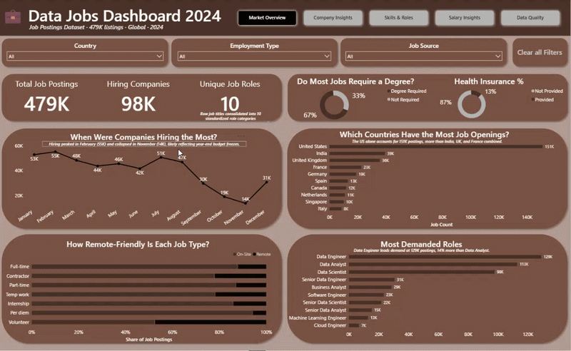
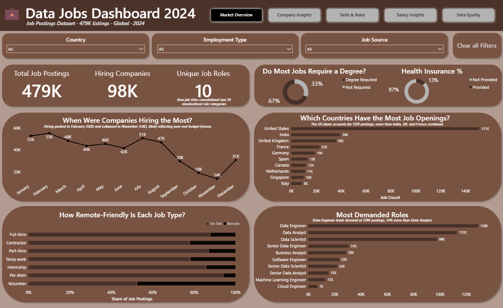
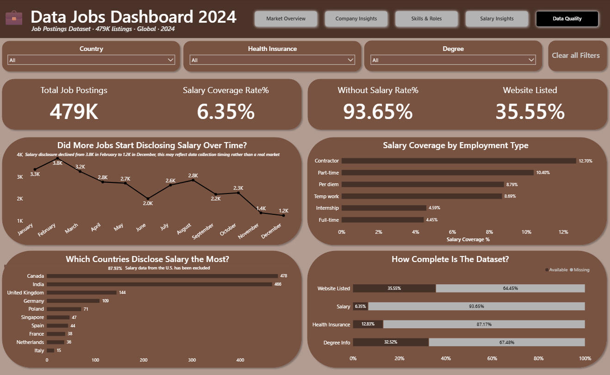
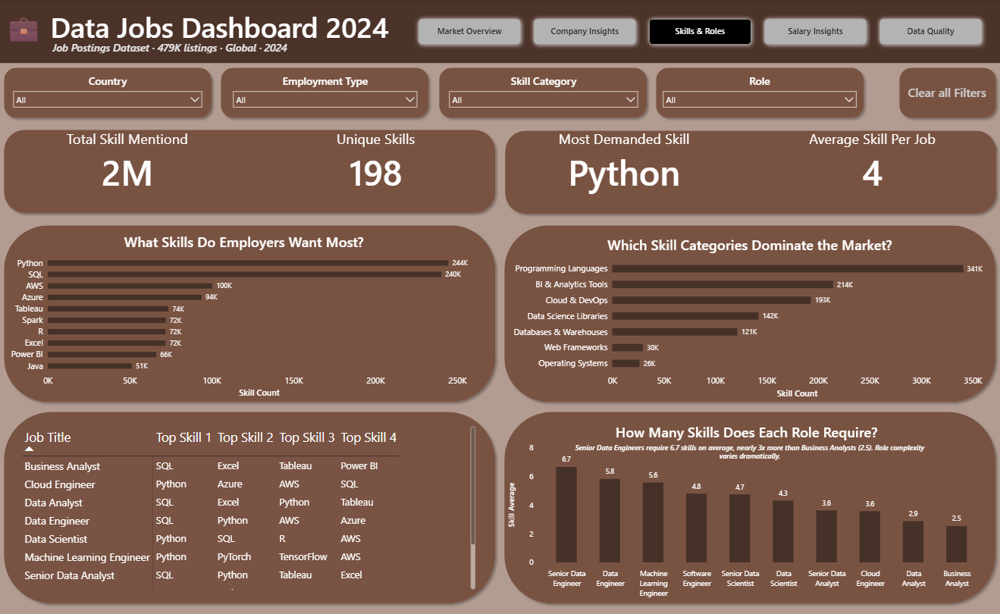
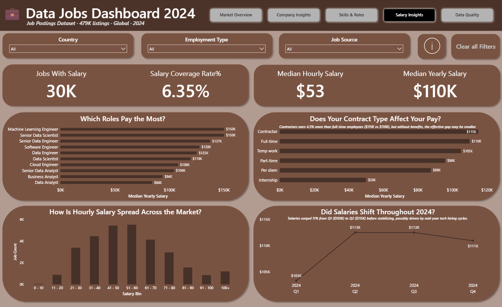
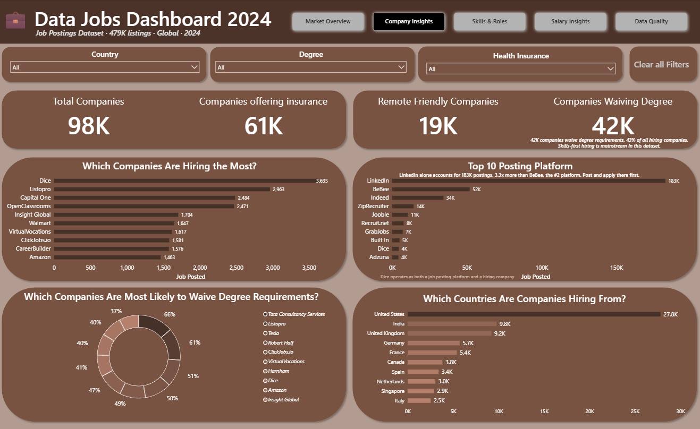

# 📊 2024 Data Jobs Market Analysis

> An end-to-end Business Intelligence solution analyzing 479,000+ global data job postings. Engineered with a scalable ETL pipeline, dimensional modeling (Star Schema), and advanced DAX to surface hiring trends, skill demands, and salary benchmarks.




#### 📁 **Dashboard file:** [`2024_Data_Jobs_Market_Analysis.pbix`](2024_Data_Jobs_Market_Analysis.pbix)
#### 📄 **Full technical documentation:** [`Documentation.md`](2024-Data-Jobs-Market-Analysis-/Documentation/Documentation.md)
#### 📂 **Original And Modified DataSets:** [`DataSets`](2024-Data-Jobs-Market-Analysis-/Datasets)
---

## 🚀 Business Impact & Key Insights

This dashboard is designed to answer critical questions for both data professionals and talent acquisition teams through Self-Service BI:

* **Role Demand:** Which data disciplines are seeing the highest volume of postings globally?
* **Skill Prerequisites:** What are the non-negotiable tech stacks for Data Engineers vs. Data Scientists?
* **Compensation Benchmarks:** How do median salaries fluctuate across employment types (Full-time vs. Contract)?
* **Data Reliability:** How much of the available job market data is statistically viable for compensation analysis?
  
**What the data reveals:**
- **Data Engineer** is the most in-demand role, with 129K postings, 14% more than Data Analyst
- **Python and SQL** lead all skills with 240K+ mentions each; cloud (AWS, Azure) follows closely
- **Median yearly salary: $110K**, but only 6.35% of postings disclosed compensation data
- **67% of jobs require no degree** skills-first hiring dominates the data job market
---

## 🏗️ Data Architecture & Tech Stack

This project was built with an engineering mindset - emphasizing scalability, data quality, and robust modeling over ad-hoc analysis.

* **ETL Pipeline Construction:** Utilized Power Query and Advanced M Code to ingest raw CSV files dynamically via `Folder.Files()`, ensuring scalable, automatic ingestion of future datasets.
* **Dimensional Modeling:** Architected a **Star Schema** to optimize query performance, replacing flat files with distinct Fact and Dimension tables.
* **Data Normalization:** Normalized multi-value and JSON-style columns into a relational structure using bridge and dimension tables, resolving many-to-many relationships cleanly.
* **Feature Engineering:** Developed dynamic DAX bucketing for salary histograms, converted Boolean values to user-friendly labels, and utilized bidirectional null-filling for annualized salary conversions.

---
## 🌟 Skills Showcased

### ⚙️ ETL & Data Transformation with Power Query
Cleaned and restructured six tables using multi-step M pipelines — including type enforcement, delimiter splitting, list expansion, merge queries, group-by aggregations, and custom column logic. Wrote all transformations in the Advanced Editor with named, chained steps.

### 🧹 Data Cleaning & Quality Management
Resolved multi-value cells, corrected data types, removed irrelevant columns, standardized 70+ skill names, deduplicated across three passes, fixed a country mislabeling anomaly (Sudan → United States) discovered through chart-driven investigation, and built an entire dashboard page dedicated to communicating data coverage gaps.

### 🗃️ Data Modeling & Star Schema Design
Designed a star schema with one central fact table surrounded by four dimension tables, one bridge table (for many-to-many skills relationships), one analytical summary table, and a dedicated Date Table marked for time intelligence. Defined all relationships in the model view.

### 🧮 DAX Measures & KPI Design
Created 24 DAX measures across two organized measure tables, covering salary statistics (median, coverage rates, sample size), skills analytics (rank, count, per-job average), benefits and degree metrics, and data quality rates. Used RANKX, MEDIAN, and context-aware filtering patterns.

### 📊 Dashboard Design & Data Storytelling
Designed five thematically distinct pages, each with a specific analytical question, purpose-matched visuals, and annotated chart subtitles that translate raw numbers into plain-language insights. Every chart title is a question; every subtitle is an answer.

### 🖱️ Interactive Reporting
Implemented dropdown slicers (with page-specific filter sets), a Clear All Filters button, a five-button top navigation bar, and an information button (ⓘ) on the Salary Insights page with a tooltip and CTRL+Click cross-page navigation link to the Data Quality page.

### 📐 Statistical Reasoning
Used median (not mean) for all salary calculations to account for skewed distributions. Surfaced salary coverage rates, sample sizes, and data completeness metrics to give context to every salary figure presented.

### 🔍 Analytical Judgment & Scope Management
Curated 198 meaningful skills from a larger raw set by defining seven skill category lists in M code and applying dual-priority categorization logic. Removed collaboration tools (Zoom, Teams, Jira) to keep the analysis focused on technical data skills. Consolidated messy job titles into 10 standardized role categories.

---
## 📸 Dashboard Walkthrough

### Market Overview (The Executive View)
Focuses on intuitive UI/UX and clear, question-based chart titles to provide immediate macro-level insights into global hiring trends.


### Data Quality & Governance (The Engineering Mindset)
Rather than hiding incomplete data, this page explicitly audits the dataset. Highlighting the 94% missing salary data demonstrates a commitment to data transparency and prevents stakeholders from making assumptions based on skewed metrics.


### Skills & Roles (M:M Relationship Architecture)
This matrix is powered by a pre-aggregated table built via complex M code and a many-to-many bridge table, standardizing over 70+ inconsistent skill variants into a clean taxonomy.


### Salary Insights (Statistical Rigor)
Utilizes **Median over Mean** to prevent high-salary outliers from skewing the data. Powered by dynamic DAX measures to filter and bucket compensation ranges accurately.


### Company Insights
Maps out the distribution of job postings across enterprise, mid-size, and startup landscapes to track employer behavior.


---

## 🛠️ Engineering Challenges & Solutions

| Challenge | Engineering Solution |
| :--- | :--- |
| **Scalable Data Ingestion** | Implemented `Folder.Files()` in M code to combine 479K rows from multiple CSVs, enabling seamless future refreshes without pipeline breakage. |
| **Annualizing Mixed Salaries** | Developed custom DAX/M logic to convert hourly/monthly rates to annual salaries using a standard 2,080-hour conversion, paired with bidirectional null-filling. |
| **Messy Skill Strings** | Built a comprehensive standardization pipeline with inline M list definitions and over 70 `if/else` rules to normalize inconsistent skill naming conventions. |
| **Anomaly Detection** | Discovered geographical mislabeling (e.g., Sudan) through chart-driven data profiling; corrected via cross-referencing string data in the `search_location` column. |

---
## 📁 Repository Structure

```
data-jobs-market-analysis/
├── DataSets
│   └──Modified
│   └──Original
├── Documentation/
│   └── DOCUMENTATION.md                 ← Full technical documentation
├── Images/
│   ├── 1_Market_Overview.png
│   ├── 2_Company_Insights.png
│   ├── 3_Skills_Roles.png
│   ├── 4_Salary_Insights.png
│   └── 5_Data_Quality.png
└── Videos/
│    └── DashboardOverview.gif
├── 2024_Data_Jobs_Market_Analysis.pbix   ← Power BI dashboard file
├── README.md                             ← Project overview (this file)
```
---
## 💻 How to Run (Live Demo)

1. Clone this repository: `https://github.com/V8FS1/2024-Data-Jobs-Market-Analysis-.git`
2. Ensure you have [Power BI Desktop](https://powerbi.microsoft.com/desktop/) installed.
3. Open the `2024_Data_Jobs_Market_Analysis.pbix` file.
4. *(Optional)* To view the ETL steps, open **Power Query Editor** (`Transform Data`). 
5. *(Optional)* To view the Data Model, navigate to the **Model View** tab on the left sidebar.

---


## 🏁 Conclusion & Future Outlook

This project represents the intersection of **Data Engineering** and **Business Intelligence**. By architecting a robust, scalable backend and a transparent, user-focused frontend, I have transformed nearly half a million rows of unstructured data into a high-performance decision-making tool.

The architecture developed here specifically the **Star Schema** and **dynamic M pipelines**, is built for growth. This project demonstrates a commitment to **data integrity** (via the Data Quality audits), **technical performance** (via dimensional modeling), and **business value** (via actionable storytelling). As the global job market continues to evolve, this modular system remains ready to ingest new data and provide persistent, reliable career intelligence.


*Built by Faisal Salama —> Data Analyst/Engineer* [](https://www.linkedin.com/in/salamafaisal) [](https://github.com/V8FS1)
